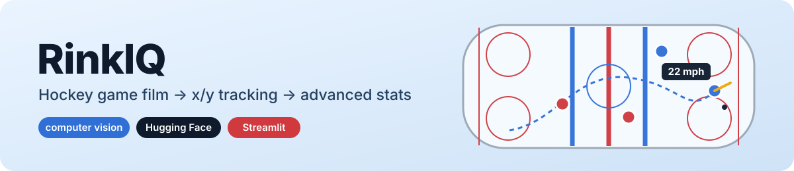
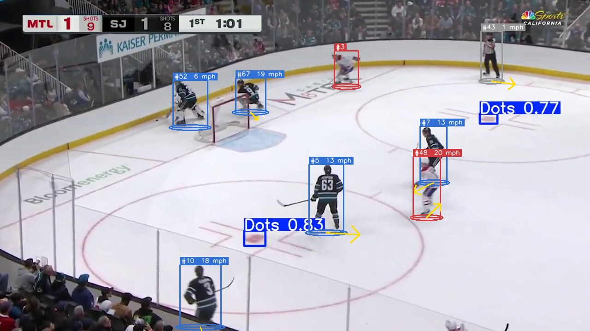
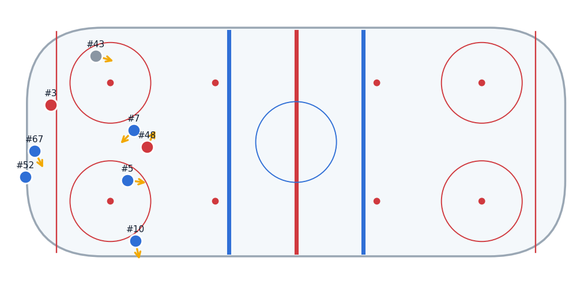
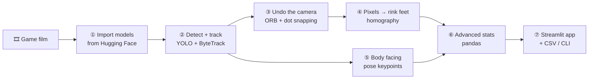
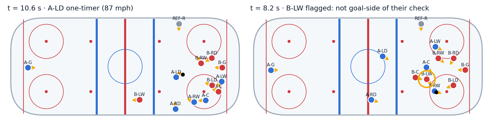
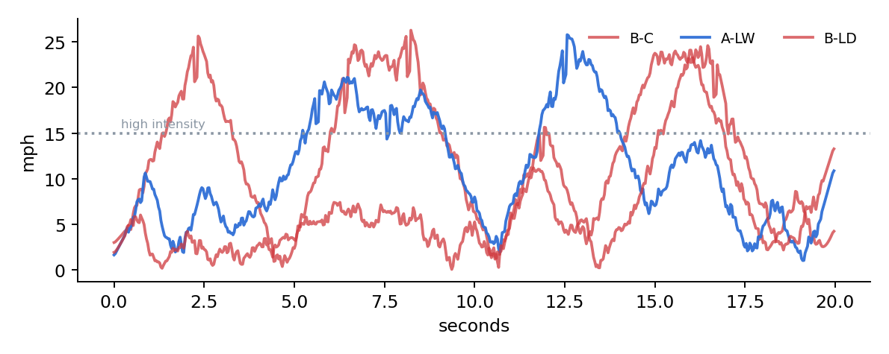

<p align="center"></p>

<p align="center">
  
  
  
  
</p>

**RinkIQ watches hockey game film and turns it into numbers.** It works out how fast every skater is
going, where they are on the ice, which way their body is facing, how hard each shot is, who is out of
position, and more. It's built from pretrained Hugging Face vision models, a classic homography, and an
analytics layer written in plain pandas and checked against ground truth.

<p align="center">
  
  
  <br><sub>Real NHL broadcast frame → every skater detected, tracked and labelled with live speed and body-facing arrow → the same moment mapped onto a top-down rink.</sub>
</p>

---

## 🧭 The walkthrough (read this first)



| Step | What happens | Where |
|---|---|---|
| **① Import models** | Download small YOLO detectors trained on NHL broadcasts from [`AlexRHaigh/Hockey-Vision`](https://huggingface.co/AlexRHaigh/Hockey-Vision): players + team, puck, rink lines, faceoff dots. Add `yolov8n-pose` for body keypoints. | [`rinkiq/models.py`](rinkiq/models.py) |
| **② Detect + track** | Every frame: find every skater, goalie and ref. ByteTrack keeps one ID per person, and the team label is a majority vote over the track. | [`rinkiq/pipeline.py`](rinkiq/pipeline.py) |
| **③ Undo the camera** | Broadcast cameras pan. ORB feature matching (players and burned-in score graphics masked out) follows the camera. Detected faceoff dots snap the estimate back onto the real rink, which fixes drift. | [`rinkiq/camera.py`](rinkiq/camera.py), [`rinkiq/rink.py`](rinkiq/rink.py) |
| **④ Pixels → feet** | Match ≥ 4 landmarks (dots, line/boards corners) to an NHL rink. The resulting 3×3 homography maps each player's skates to rink coordinates in feet. | [`rinkiq/rink.py`](rinkiq/rink.py) |
| **⑤ Body facing** | Shoulder order (front/back), shoulder width (angle to camera) and nose offset (left/right) give a facing vector, which feeds the *skating backwards* stat. | [`rinkiq/pose.py`](rinkiq/pose.py) |
| **⑥ Stats** | Smoothing, kinematics, possession, passes, shots, goal-side, structure, team shape and a composite *Skate Score*. | [`rinkiq/metrics.py`](rinkiq/metrics.py) |
| **⑦ Present** | Streamlit app with a film scrubber, leaderboard, heatmaps, rink replay and a clickable "out of position" film-review list. | [`app.py`](app.py) |

### What it measures

| Skating | Puck & events | Positioning |
|---|---|---|
| Top speed (fastest 0.5 s) | Possession time | Goal-side % when defending |
| Average speed, distance | Passes & turnovers | In-position % vs. own usual spot |
| Bursts (hard accelerations) | **Shot speed** + shot map | Gap to nearest attacker |
| Time > 15 mph | Shooter & release point | Space created when attacking |
| Skating backwards % | | Zone time (OZ / NZ / DZ), team width & depth |

**Skate Score** (0–100) is a percentile blend: top speed 25 %, average speed 15 %, bursts per minute 20 %,
in-position 20 % and space 20 %. The weights are in one dict, so you can argue with them.

---

## ✅ Does it actually work? Validation against ground truth

Real game film doesn't come with true speeds, so [`rinkiq/simulate.py`](rinkiq/simulate.py) generates a
scripted 20-second sequence: a breakout, a zone entry, an **88 mph** one-timer, and a counter-attack ending
in a **72 mph** wrist shot. It adds tracking noise and drops 15 % of puck detections. One winger *cheats* up
ice on purpose. Across 5 random seeds:

| Check | Result |
|---|---|
| Passes found | **25 / 25** |
| Shots found | **10 / 10**, speed error ≤ 3.3 % |
| Top speed, mean abs. error | **0.7 mph** (50 skater-runs) |
| Cheating winger flagged "out of position" | **5 / 5** |
| Defencemen skating backwards vs. forwards | ~30 % vs. 0 % ✔ |

<p align="center"></p>
<p align="center"></p>

The vision side was tested on a real 10-second NHL broadcast clip. Calibrated on 5 landmarks (mean error
2.9 ft), dot snapping keeps the end-zone faceoff dots within ~1–5 ft of their true spots through a full
camera pan (without it, drift reached ~40 ft). Run `pytest` for the automated checks.

---

## 🚀 Run it

```bash
git clone https://github.com/CohenTheCoder/rink-iq.git && cd rink-iq
python3 -m venv .venv && source .venv/bin/activate
pip install -r requirements.txt
streamlit run app.py
```

Then, in the app:

1. **① Film** → *Synthetic demo game* for an instant tour, or *Sample NHL broadcast clip* (downloaded from
   Hugging Face), or upload your own.
2. **② Calibrate** → *Auto-detect faceoff dots* (or *Use hand-checked points* for the sample) → *Solve*. The
   warped top-down preview shows whether it's right.
3. **③ Detect & track** → *Run*. Scrub through the film with boxes, speeds and facing arrows.
4. **④ Stats** and **⑤ Film review**. Click any out-of-position moment to see it.

Prefer the terminal?

```bash
python scripts/analyze.py --demo                            # synthetic game
python scripts/analyze.py film.mp4 --seconds 10             # speed-only mode
python scripts/analyze.py film.mp4 --points points.json     # calibrated: rink feet
pytest                                                      # validation suite
```

> **CPU only?** That's fine. Expect ~0.3–0.8 s per frame on a laptop. "Fast" mode analyses 15 fps
> without pose.

## 📁 Project layout

```
rink-iq/
├── app.py                    # Streamlit app (the "present" step)
├── rinkiq/
│   ├── models.py             # ① Hugging Face model loading
│   ├── pipeline.py           # ② detect → track → map, produces tidy DataFrames
│   ├── camera.py             # ③ camera-motion compensation, overlay masking, cut detection
│   ├── rink.py               # ④ rink geometry, landmarks, homography, dot snapping
│   ├── pose.py               # ⑤ body orientation from keypoints
│   ├── metrics.py            # ⑥ every stat, in readable pandas
│   ├── simulate.py           # synthetic game with ground truth
│   └── draw.py               # video overlays
├── scripts/analyze.py        # CLI → CSVs
├── scripts/make_readme_assets.py
├── tests/                    # pytest: metrics vs. ground truth, geometry
└── docs/HOW_IT_WORKS.md      # the in-app explainer
```

## ⚠️ Honest limitations

- **The puck is tiny and often hidden**, so shot speed needs it visible for a few frames. Broadcast film
  gives fewer shot readings than the simulation.
- **Calibration is best near the landmarks** you click. Dot snapping repairs most of the pan drift, but a hard
  camera cut needs a new calibration (the app warns when it finds one).
- **Team labels come from jersey colour** and can flip with unusual uniforms.
- **Facing is a 2-D heuristic.** It's good for "forwards vs. backwards", not for exact angles.
- "Out of position" is a transparent rule meant to surface clips worth watching, not a coach's verdict.

## 🛣️ Next ideas
Jersey-number reading (the Hockey-Vision number model) to name players · fully automatic per-frame
calibration from lines + dots · expected-goals model from shot location/speed · line-change detection.

## 🙏 Credits
Detectors: [AlexRHaigh/Hockey-Vision](https://huggingface.co/AlexRHaigh/Hockey-Vision) (Apache-2.0) ·
Pose: [Ultralytics YOLOv8](https://github.com/ultralytics/ultralytics) · Tracking: ByteTrack.
Sample clips are downloaded on demand from the model author's repo and are not redistributed here.
